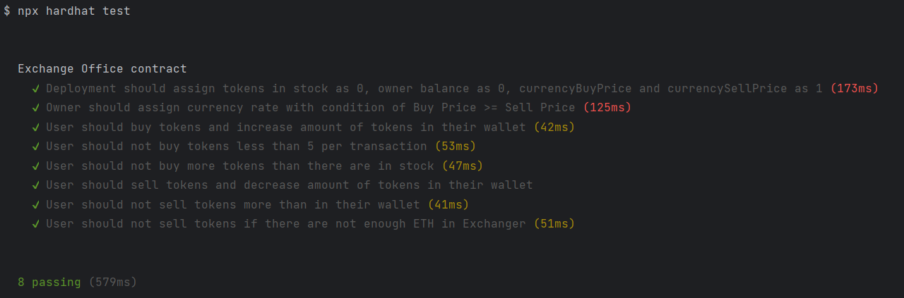
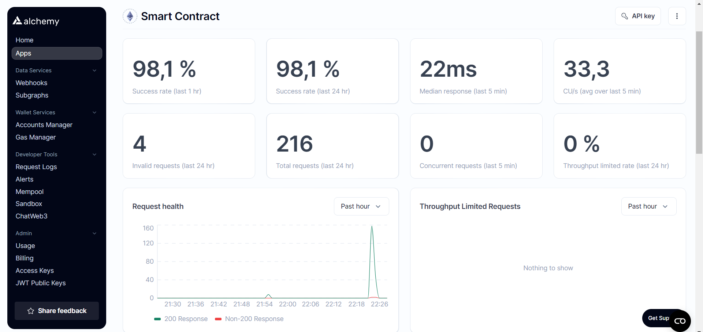

# Smart Contract

## Contract Name: ExchangeOffice

### Description:
ExchangeOffice is a smart contract deployed on the Ethereum blockchain. It serves as an exchange platform for buying and selling tokens using Ether. The contract allows the owner to manage the exchange rates and token balances.

### Functionality:

| Function Name            | Description                                               | Access       |
|--------------------------|-----------------------------------------------------------|--------------|
| `_fillMoney`             | Allows the owner to deposit Ether into the contract.      | Owner Only   |
| `_fillToken`             | Allows the owner to deposit tokens into the contract.     | Owner Only   |
| `_getMoney`              | Allows the owner to withdraw all Ether from the contract. | Owner Only   |
| `_updateCurrency`        | Allows the owner to update the currency exchange rates.   | Owner Only   |
| `buyTokens`              | Allows users to buy tokens from the contract with Ether.  | Public       |
| `sellTokens`             | Allows users to sell tokens to the contract for Ether.    | Public       |
| `getInStock`             | Returns the current balance of tokens held by the contract. | Public     |
| `getYoursTokenBalance`   | Returns the token balance of the caller.                  | Public       |

### Access Levels:

- **Public**: These functions can be called by any address interacting with the contract.
- **Owner Only**: These functions can only be called by the address that deployed the contract.

1. **Filling Money and Tokens**: Call `_fillMoney` and `_fillToken` to deposit Ether and tokens into the contract, respectively.
2. **Withdrawing Money**: Use `_getMoney` to withdraw all Ether from the contract.
3. **Updating Currency Rates**: Call `_updateCurrency` to update the buy and sell rates of the tokens.
4. **Buying Tokens**: Use `buyTokens` to purchase tokens from the contract by sending Ether.
5. **Selling Tokens**: Call `sellTokens` to sell tokens to the contract in exchange for Ether.
6. **Checking Balances**: Utilize `getInStock` to check the contract's token balance and `getYoursTokenBalance` to check the token balance of the caller.

### Usage:
1. **Filling Money and Tokens:**

- Function: _fillMoney
  - Description: This function allows the owner to deposit Ether into the contract.
  - Limitations: None
- Function: _fillToken
  - Description: This function enables the owner to deposit tokens into the contract.
  - Limitations: None
 
2. **Withdrawing Money:**

- Function: _getMoney
  - Description: This function allows the owner to withdraw all Ether from the contract.
  - Limitations: None

3. **Updating Currency Rates:**

- Function: _updateCurrency
  - Description: This function permits the owner to update the buy and sell rates of the tokens.
  - Limitations:
    - The buyPrice must be greater than or equal to the sellPrice.
    - First argument is buyPrice, second one - sellPrice.

4. **Buying Tokens:**

- Function: buyTokens
  - Description: Users can buy tokens from the contract by sending Ether.
  - Limitations:
    - The value of Ether sent must be sufficient to buy at least minimumAmountPerTransaction tokens.
    - The contract must have enough tokens in stock to fulfill the purchase.

5. **Selling Tokens:**

- Function: sellTokens
  - Description: Users can sell tokens to the contract in exchange for Ether.
  - Limitations:
    - The amount of tokens to sell must be at least minimumAmountPerTransaction.
    - The caller must have enough tokens to sell.

6. **Checking Balances:**

- Function: getInStock
  - Description: Returns the current balance of tokens held by the contract.
  - Limitations: None

- Function: getYoursTokenBalance
  - Description: Returns the token balance of the caller.
  - Limitations: None
    
### Additional Notes:
- The minimumAmountPerTransaction parameter sets the minimum value of tokens that can be transacted in a single buy or sell operation.
- Ownership of the contract allows exclusive access to certain functions such as depositing and withdrawing funds, and updating exchange rates. These functions are restricted to the owner address specified during contract deployment.
- Users interacting with the contract must ensure that they comply with the minimum transaction amount requirement and verify the availability of tokens in the contract's stock before buying. Similarly, they must ensure they possess sufficient tokens before attempting to sell.

## How to run tests
1. Download NodeJS environment (version >= 20) for JavaScript
2. Build project with yarn:
    - yarn install
    - npx hardhat compile
    - npx hardhat test
   
3. Verify that all tests passed

## Deployed contract

- Contract is deployed to Sepolia test network with address:

- Proof of work 
  - 
